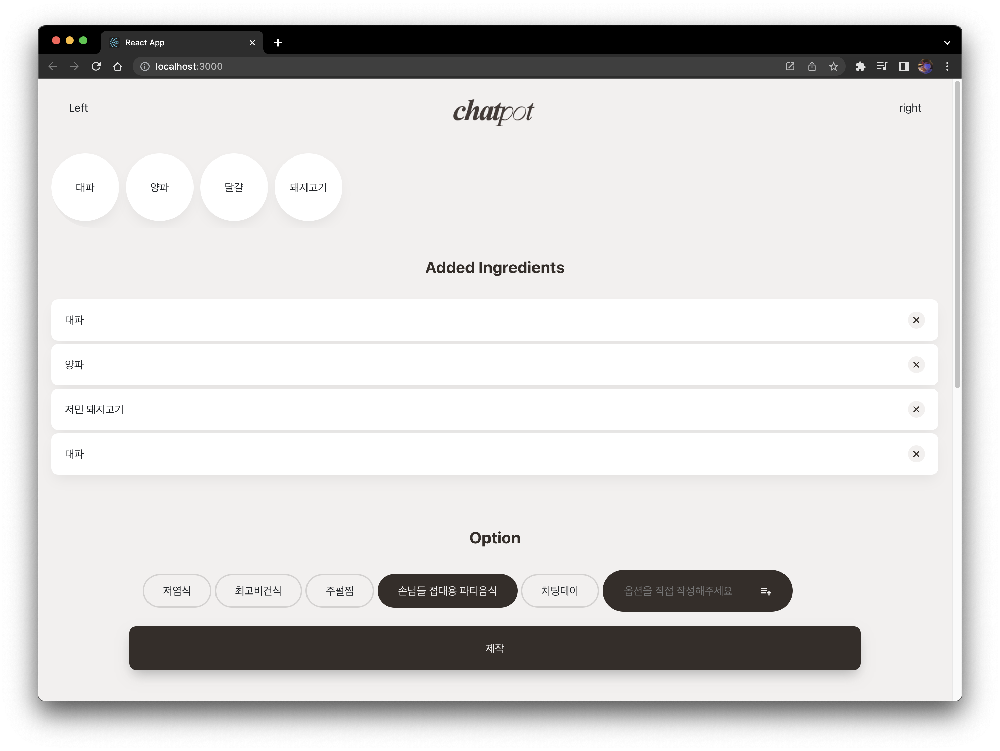

<!-- Project anouncement -->

# 🍯 <b>ChatPot</b>


<br>

<!-- Develop history -->

# 📝 <b>개발로그</b>

<details>
<summary><b>2023/06/04 (현도,BE)</b></summary>

<h2><b>✅ Done</b></h2>

- 정규 표현식을 이용해 chatGPT에게 받은 추천 레시피를 parsing
- React로 추천받은 레시피 parsing 결과를 전송
  - (에러) axios를 이용해 통신하는데 res.send로 보낸 값을 React에서 제대로 받아오지 못함.
    - axios.get()으로 한번 더 받아오는 것이 아니라 post 요청 후 then을 이용해 결과값을 받아오도록 수정
    - React에서 json 형태로 변환하지 않고 res.json을 이용해 서버에서 json 형태로 전송
- POST 요청받은 식재료, 옵션 값이 null 일때 예외 처리
- <br>
  <h2><b>⚙️ in Progess</b></h2>

- 구현 중인 내용
  - 좀 더 정확한 chatGPT 답변을 위한 역할 부여 메시지, 파라미터 수정

<br>
<h2><b>📚 Next</b></h2>

- 구현 예정
  - aws, heroku 등을 이용한 서버 배포
  - 배포 후 테스트 및 버그 수정

<br>
</details>
<details>
<summary><b>2023/06/03 (재웅,FE)</b></summary>

<h2><b>✅ Done</b></h2>

- MakeRequest
  - Post / Get 구현
  - Get 요청 완료 시 까지 로딩 출력 로직 구현
  - 데이터 정상적으로 넘겨받으면 페이지 이동

<br>
<h2><b>📚 Next</b></h2>

- GPT API에서 요청받아온 실제 데이터 출력 테스트
- /recipe 레이아웃 리팩토링 ..

<br>
</details>

<details>
<summary><b>2023/06/02 (재웅,FE)</b></summary>

<h2><b>✅ Done</b></h2>

- 프로젝트 readme에 개발로그 양식 작성 및 기존 로그 백업
- NavBar 프로필 아이콘 Hover animation

<br>
</details>

<details>
<summary><b>2023/05/25 (현도,BE)</b></summary>
<br>
<h2><b>⚙️ in Progess</b></h2>

- 구현 중인 내용
  - chatGPT 답변을 match, split을 이용해 요리 이름, 식재료, 레시피 순서로 구분
    - (에러) 답변이 원하는 대로 돌아오지 않음.
      - 정확한 답변을 위해 temperature, top_p 등 chatGPT 파라미터 조정
      - 역할 부여 및 user 메시지를 좀 더 구체적으로 수정
  - parsing한 레시피 추천 정보를 res.send를 이용해 React로 전송
    <br>

<br>
</details>
<details>
<summary><b>2023/05/24 (재웅,FE)</b></summary>

<h2><b>✅ Done</b></h2>

- /recipe 페이지 레이아웃
  - bootstrap-grid를 통해 레이아웃과 버튼 구현
  - 모바일 환경에서도 Single Row로 호환

<br>
<h2><b>📚 Next</b></h2>

- Get 요청 통한 GPT API 답변 받아오기
- 받아온 데이터 { 메뉴명 / 소개 / 식재료 / 레시피 } 형태로 Parsing
- Get 요청 성공 전까지 출력할 Loading 화면 구현 및 구조 정립
  - React-query?
  - "제작"버튼 클릭 시 Loading 화면을 "/" 페이지에서 출력 후 Get 성공 시 "/Recipe" 페이지로 이동할 것인지, 이동 후 처리할 것인지

<br>
</details>

<details>
<summary><b>2023/05/23 (현도,BE)</b></summary>

<h2><b>✅ Done</b></h2>

- 이용자가 선택한 옵션, 식재료를 POST 요청으로 받아와 request 값들 저장
- 받아온 request 값들을 이용해 역할이 부여된 chatGPT에게 레시피 추천 요청
- chatGPT가 답변해준 레시피를 서버에 저장

<br>
<h2><b>⚙️ in Progess</b></h2>

- 구현 중인 내용
  - chatGPT가 답변해준 레시피를 요리 이름, 식재료, 레시피 순서로 parsing
  - 좀 더 정확한 chatGPT 답변을 위한 역할 부여 메시지 수정

<br>
<h2><b>📚 Next</b></h2>

- 구현 예정
  - React에서 POST 요청에 대한 chatGPT 답변이 잘 받아지는지 확인
  - 답변이 받아진 상태로 recipe 페이지로 라우팅 되는지 확인

<br>
</details>
<details>
<summary><b>2023/05/23 (재웅,FE)</b></summary>

<!-- 1. 작업 일자에 따라 내림차순으로 작성해주세요 -->
<!-- 2. Agenda 혹은 Error는 Github Issues에 작성해주세요 -->

<h2><b>✅ Done</b></h2>

- 폼 입력 이슈 해결
  - (에러) onChange를 통해 입력받은 값을 State에 저장하려 했으나 콜백함수 사용과정에서 한 글자 입력할 때마다 포커스가 풀리는 문제 발생
  - (해결) React-hook-form 모듈을 통한 이슈 해결
  - 앞으로 구현할 chatBot 페이지나 로그인 등 많은 곳에서 폼 태그를 사용할 것으로 보이기 때문에, 구현과 관리가 용이한 라이브러리를 사용하기로 하였음
- 직접 입력한 식재료 / 옵션의 화면 출력을 State 내부 Reducer를 통해 구현하였음

<br>
<h2><b>📚 Next</b></h2>

- "제작"버튼 클릭 후 페이지 전환 (-> /recipe)
- /recipe 페이지 레이아웃 구현

<br>
</details>

<details>
<summary><b>2023/05/21 (재웅,FE)</b></summary>

<h2><b>✅ Done</b></h2>

- 컴포넌트 분리
  - 기존 App.js에 몰려 있던 컴포넌트들을 개별 파일로 분할하였음
  - App.js에 모든 컴포넌트를 Import 시 가독성이 떨어지기 때문에, 별도의 Components 파일에 컴포넌트를 Import한 후 해당 파일에서 불러오는 식으로 리팩토링하였음.
  - (예시) `import { optionList, selectedList, makeRequest} from './componets.js'`
- 컴포넌트 별 스타일 적용 (Styled-components)
  - 기존 app.js에 클래스 형식으로 분류되어 있던 스타일을 개별 컴포넌트 파일 내부에서 Styled-components를 통해 지정하도록 리팩토링하였음.

<br>
<h2><b>📚 Next</b></h2>

- 폼 입력 이슈 해결 및 입력한 내용 화면 출력 구현

<br>

<h2><b>🖼️ Preview</b></h2>

<!-- 경로예시 -->
<!--  -->
</details>

<details>
<summary><b>2023/05/20 (현도,BE)</b></summary>

<h2><b>✅ Done</b></h2>

- POST 요청 구현
  ```javascript
  app.use(express.json());
  app.use(express.urlencoded({ extended: true }));
  ```
- chatGPT 역할 부여
  - 세계 최고의 요리사이고, 요리 관련 지식이 풍부해 어떤 식재료와 옵션이든 대답해줄 수 있음.
  - 추천은 하나의 요리만 추천해 줌.
  - 답변 순서는 요리 이름, 식재료, 레시피 순서 형태로 답변해줌.
  - Temperature(무작위성, 자유도)를 낮춰 답변에서 일어나는 버그 제어

<br>
<h2><b>⚙️ in Progess</b></h2>

- 구현 중인 내용
  - chatGPT의 답변을 javascript 변수로 parsing
  - parsing된 값들을 React로 전송

<br>
<h2><b>📚 Next</b></h2>

- 구현 예정
  - 요청받은 POST에 대한 response 값을 React에 잘 전송되는지 확인.
  - res.send로 잘 안보내진다면 json 형태로 변환 후 전송.

<br>
</details>

<details>
<summary><b>2023/05/20 (재웅,FE)</b></summary>

<h2><b>✅ Done</b></h2>

- State 바인딩
  - 식재료 및 옵션 클릭 시 State에 값을 저장하고, 선택된 리스트를 화면에 출력하게 하였음
- Ajax 요청
  - Axios를 통해 "제작"버튼 클릭 시 입력해놓은 식재료와 옵션을 객체 형태로 서버에 전송될 수 있게 구현하였음
  - 식재료는 ingredients Key에, 옵션은 options Key에 저장되어 전송

<br>
<h2><b>⚙️ in Progess</b></h2>

- 리스트에 없는 식재료 및 옵션 직접 작성하여 추가
  - (에러) Input 폼에 작성한 값을 State에 저장하는 과정에서 한 글자 입력할 때마다 아웃포커싱되는 현상이 발생. 추가(+) 버튼과 바인딩하기 위해선 꼭 State에 저장해야 되는데 ..

<br>
<h2><b>📚 Next</b></h2>

- 폼 입력 이슈 해결
- 컴포넌트 분리와 개별 스타일링

<br>
</details>
<details>
<summary><b>2023/05/18 (현도,BE)</b></summary>
<h2><b>✅ Done</b></h2>

- Node.js 서버와 chatGPT API 연동
- cors 예외 처리
  ```javascript
  var cors = require("cors");
  app.use(cors());
  ```
- API_KEY 환경변수 처리
  <br>

<br>
<h2><b>📚 Next</b></h2>

- 구현 예정
  - React에서 받아온 식재료, 옵션을 chatGPT에게 전송
  - chatGPT의 레시피 추천 결과를 이름, 식재료, 레시피 순서로 Parsing
  - parsing된 정보를 React로 전송

<br>
</details>
<details>
<summary><b>2023/05/16 (현도,BE)</b></summary>
<h2><b>✅ Done</b></h2>

- Express 웹 서버 생성
- React로 만든 HTML을 Node.js로 전송
- Node.js 서버와 React 연동

<br>

<br>
<h2><b>📚 Next</b></h2>

- 구현 예정
  - chatGPT API 연동
  - React와 Node.js 사이의 데이터 요청

<br>
</details>

<details>
<summary><b>2023/05/15 (재웅,FE)</b></summary>

<h2><b>✅ Done</b></h2>

- 전반적인 레이아웃 구현
  - 선택된 식재료 리스트 출력 (SelectedList)
  - 옵션 선택 (OptionList / SelectedOption)

<br>
<h2><b>📚 Next</b></h2>

- Styled-components 리팩터링
  - 라이브러리 설치 간 오류가 발생하여 사용하지 못했는데, 문제 발견 후 해결하였음
  - (해결) 기존에 설치된 라이브러리의 버전 문제로, 버전업 해주었음
  - (코드) `npm install styled-components@latest`
- State 바인딩
  - 식재료 및 옵션 선택 시 SelectedList에 State 값으로 추가, 화면에 출력까지

<br>
<h2><b>🖼️ Preview</b></h2>

</details>

<details>
<summary><b>2023/05/07 (재웅,FE)</b></summary>

<h2><b>✅ Done</b></h2>

- Route, Redux, Bootstrap 라이브러리 설치
- 식재료 선택 (SelectList) 구현

<br>
<h2><b>⚙️ in Progess</b></h2>

- 식재료 선택 (SelectList) 구현

  - 버튼 활성화 시 CSS 변경, SelectedList에 State 값 전송 구현
  - (에러 1) 클릭 시 변경되는 State 값을 삼항연산자를 통해 Boolean 타입으로 제어하였는데, 콘솔 디버깅 시 한 차례 딜레이 발생
  - (해결 1) 리액트 동작 구조 상 렌더링 우선순위에 의해 발생하는 문제였으며, useEffect 훅을 통해 컴포넌트의 라이프사이클을 조정함으로써 문제 해결

<br>
<h2><b>📚 Next</b></h2>

- 선택된 식재료 (SelectedList) 구현
  - 식재료 선택 시 SelectedList State로 Push
  - SelectedList에서 제거(-) 클릭 시, 해당 이름을 가진 Element 제거

<br>
<h2><b>🖼️ Preview</b></h2>

</details>

<details>
<summary><b>작성예시</b></summary>

<!-- 1. 작업 일자에 따라 내림차순으로 작성해주세요 -->
<!-- 2. Agenda 혹은 Error는 Github Issues에 작성해주세요 -->

<h2><b>✅ Done</b></h2>

- 구현한 내용

<br>
<h2><b>⚙️ in Progess</b></h2>

- 구현 중인 내용
  - 세부사항1
  - 세부사항2

<br>
<h2><b>📚 Next</b></h2>

- 구현 예정
  - 세부사항1
  - 세부사항2

<br>

<h2><b>🖼️ Preview</b></h2>

<!-- 경로예시 -->
<!--  -->
</details>
